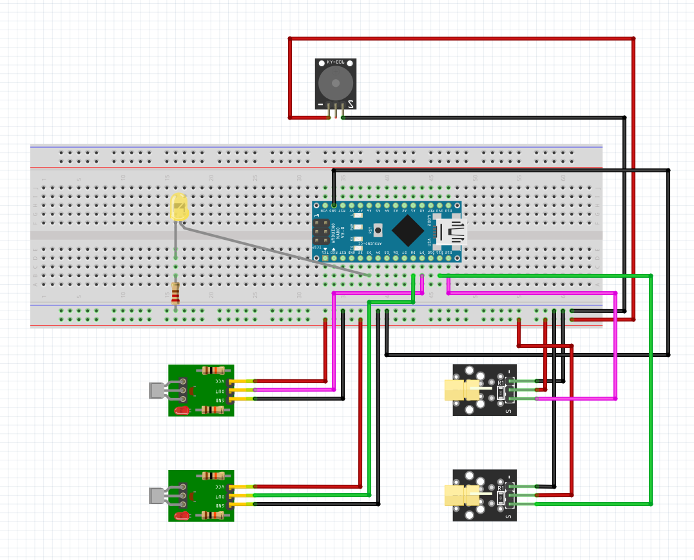

# Sistem optic de detectare a intrusilor intr-o incapere
<h2>1.	Componente</h2>

•	Modul Buzzer: Acesta este compus dintr-un buzzer si un tranzistor pnp. Tranzitorul ne ofera posibilitatea de a controla buzzerul. 

•	Modul Laser: KY-008 Laser este un modul emite o rază laser roșie în formă de punct. 

•	Modul receptor laser: Acest modul include un senzor LDR (fotorezistor) si putem obține o ieșire digitală concentrând lumina laser pe ea. 

<h2>2.	Functionalitate</h2>

In ceea ce priveste functionalitatea acestui proiect nu este nimic complicat. A fost mai greu sa gasesc piesele (aparent nu toata lumea vinde diode laser persoanelor fizice). Dupa legarea pieselor, conform schemei atasate mai jos. 

A urmat partea de cod, care este si ea destul de simpla. Mi-am definit pinii necesar ai componentelor, astfel incat sa fie mai usor de interpretat. 

In zona de setup, am definit rolul fiecarui pin OUTPUT (diodele laser, ledul si buzzer-ul) si INPUT (receptorii). 

In zona de loop() am pornit initial diodele laser si am stetat doua variabile de tip bool pentru a prelua valoarea din receptori. Daca unul dintre receptori reda valoare 0, adica este intrerupta raza laser, atunci se va aprinde led-ul, iar buzzer-ul va produce un sunet, pentru a reprezenta o alarma. 

